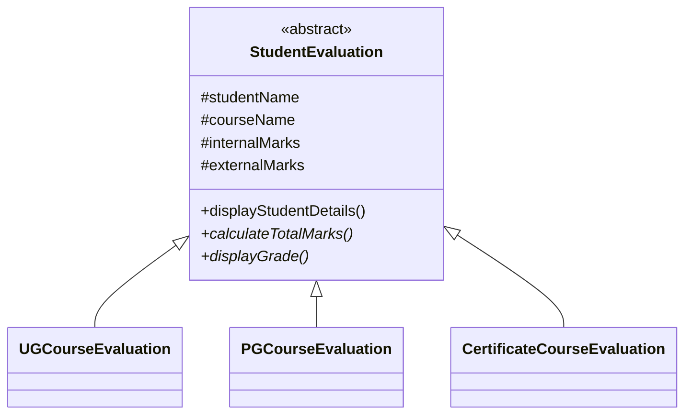
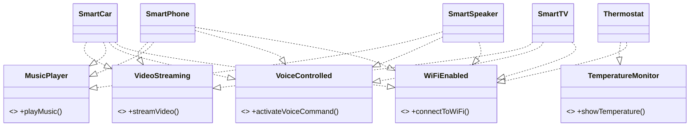
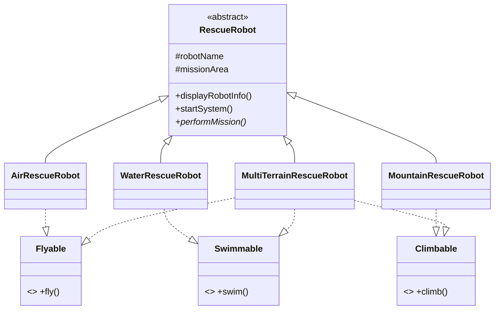

# Class Diagrams

## Task 1 - University Evaluation System

```mermaid
classDiagram
    class StudentEvaluation {
        <<abstract>>
        #studentName
        #courseName
        #internalMarks
        #externalMarks
        +displayStudentDetails()
        +calculateTotalMarks()*
        +displayGrade()*
    }
    class UGCourseEvaluation
    class PGCourseEvaluation
    class CertificateCourseEvaluation
    StudentEvaluation <|-- UGCourseEvaluation
    StudentEvaluation <|-- PGCourseEvaluation
    StudentEvaluation <|-- CertificateCourseEvaluation
```

## Task 2 - Smart Device Control System

```mermaid
classDiagram
    class WiFiEnabled { <<interface>> +connectToWiFi() }
    class VoiceControlled { <<interface>> +activateVoiceCommand() }
    class MusicPlayer { <<interface>> +playMusic() }
    class VideoStreaming { <<interface>> +streamVideo() }
    class TemperatureMonitor { <<interface>> +showTemperature() }
    class SmartSpeaker
    class SmartTV
    class Thermostat
    class SmartPhone
    class SmartCar
    SmartSpeaker ..|> WiFiEnabled
    SmartSpeaker ..|> VoiceControlled
    SmartSpeaker ..|> MusicPlayer
    SmartTV ..|> WiFiEnabled
    SmartTV ..|> VoiceControlled
    SmartTV ..|> VideoStreaming
    Thermostat ..|> WiFiEnabled
    Thermostat ..|> TemperatureMonitor
    SmartPhone ..|> WiFiEnabled
    SmartPhone ..|> VoiceControlled
    SmartPhone ..|> MusicPlayer
    SmartPhone ..|> VideoStreaming
    SmartCar ..|> WiFiEnabled
    SmartCar ..|> VoiceControlled
    SmartCar ..|> MusicPlayer
    SmartCar ..|> VideoStreaming
```

## Task 3 - Emergency Rescue Robot

```mermaid
classDiagram
    class RescueRobot {
        <<abstract>>
        #robotName
        #missionArea
        +displayRobotInfo()
        +startSystem()
        +performMission()*
    }
    class Flyable { <<interface>> +fly() }
    class Swimmable { <<interface>> +swim() }
    class Climbable { <<interface>> +climb() }
    class AirRescueRobot
    class WaterRescueRobot
    class MountainRescueRobot
    class MultiTerrainRescueRobot
    RescueRobot <|-- AirRescueRobot
    RescueRobot <|-- WaterRescueRobot
    RescueRobot <|-- MountainRescueRobot
    RescueRobot <|-- MultiTerrainRescueRobot
    AirRescueRobot ..|> Flyable
    WaterRescueRobot ..|> Swimmable
    MountainRescueRobot ..|> Climbable
    MultiTerrainRescueRobot ..|> Flyable
    MultiTerrainRescueRobot ..|> Swimmable
    MultiTerrainRescueRobot ..|> Climbable
```
